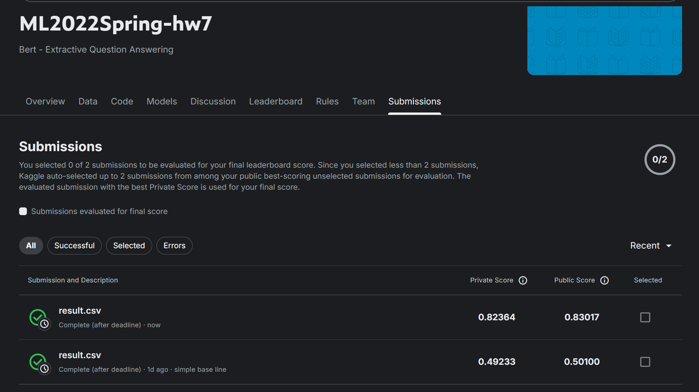

# HW 7 	BERT

HW7 Bert (Question Answering)

**kaggle url:** [ML2022Spring-hw4](https://www.kaggle.com/competitions/ml2022spring-hw7/)
**PDF url:** [HW04.pdf](https://speech.ee.ntu.edu.tw/~hylee/ml/ml2022-course-data/hw7_slides.pdf)

### Task
Extractive Question Answering

### Grading -- Kaggle and Hints
```
---- simple baseline ----
Score: 0.4513

---- medium baseline ----
Score: 0.65792

---- strong baseline ----
Score:0.78136

---- boss baseline ----
Score:0.84388
```

### Dataset: DRCD & ODSQA
**DRCD:** 台達閱讀理解資料集 Delta Reading Comprehension Dataset [DRCD](https://github.com/DRCKnowledgeTeam/DRCD)
**ODSQA:** Open-Domain Spoken Question Answering Dataset
```
● train: DRCD + DRCD-TTS
    ○ 10524 paragraphs, 31690 questions
● dev: DRCD + DRCD-TTS
    ○ 1490 paragraphs, 4131 questions
● test: DRCD + ODSQA
    ○ 1586 paragraphs, 4957 questions
```

### 相关的核心论文
[SQuAD: 100,000+ Questions for Machine Reading Comprehension](https://arxiv.org/abs/1606.05250)
[BERT: Pre-training of Deep Bidirectional Transformers for Language Understanding](https://arxiv.org/abs/1810.04805)
[Pre-Training with Whole Word Masking for Chinese BERT](https://arxiv.org/abs/1906.08101)

### 原代码理解
**Tokenize Data:**
```python
# 分词器在做的事情：
"你好世界" → ["你", "好", "世", "界"] → [872, 1266, 686, 4518]
```
**Dataset and Dataloader:**
```python
class QA_Dataset(Dataset):
    def __init__(self, split, questions, tokenized_questions, tokenized_paragraphs):
        self.split = split  # 数据集类型："train", "dev", 或 "test"
        self.questions = questions  # 原始问题数据
        self.tokenized_questions = tokenized_questions  # 分词后的问题
        self.tokenized_paragraphs = tokenized_paragraphs  # 分词后的段落
        
        # 设置最大长度限制
        self.max_question_len = 40   # 问题最大长度（token数）
        self.max_paragraph_len = 150 # 段落窗口最大长度（token数）

        ##### TODO: Change value of doc_stride #####
        # 滑动窗口的步长，决定相邻窗口的重叠程度
        self.doc_stride = 150

        # 计算输入序列的最大长度
        # 格式：[CLS] + 问题 + [SEP] + 段落 + [SEP] = 1 + 40 + 1 + 150 + 1 = 193
        self.max_seq_len = 1 + self.max_question_len + 1 + self.max_paragraph_len + 1

    def __len__(self):
        # 返回数据集的大小（问题数量）
        return len(self.questions)

    def __getitem__(self, idx):
        # 获取指定索引的数据
        question = self.questions[idx]  # 第idx个问题
        tokenized_question = self.tokenized_questions[idx]  # 对应的分词结果
        tokenized_paragraph = self.tokenized_paragraphs[question["paragraph_id"]]  # 对应段落的分词结果

        ##### TODO: Preprocessing #####
        # 这里可以添加数据预处理，防止模型学习不应该学习的内容

        if self.split == "train":
            # 【训练模式】：需要知道正确答案的位置
            
            # 将答案在原文中的字符位置转换为token位置
            answer_start_token = tokenized_paragraph.char_to_token(question["answer_start"])
            answer_end_token = tokenized_paragraph.char_to_token(question["answer_end"])

            # 以答案为中心，截取包含答案的段落窗口
            mid = (answer_start_token + answer_end_token) // 2  # 答案中心位置
            # 确保窗口包含答案，且不超出段落边界
            paragraph_start = max(0, min(mid - self.max_paragraph_len // 2, len(tokenized_paragraph) - self.max_paragraph_len))
            paragraph_end = paragraph_start + self.max_paragraph_len

            # 构造输入序列：[CLS] + 问题 + [SEP] + 段落片段 + [SEP]
            # 101是[CLS]的token id，102是[SEP]的token id
            input_ids_question = [101] + tokenized_question.ids[:self.max_question_len] + [102]
            input_ids_paragraph = tokenized_paragraph.ids[paragraph_start : paragraph_end] + [102]

            # 调整答案位置：原来相对于整个段落，现在相对于窗口+问题
            answer_start_token += len(input_ids_question) - paragraph_start
            answer_end_token += len(input_ids_question) - paragraph_start

            # 对序列进行padding，使长度统一
            input_ids, token_type_ids, attention_mask = self.padding(input_ids_question, input_ids_paragraph)
            
            # 返回训练所需的所有数据
            return torch.tensor(input_ids), torch.tensor(token_type_ids), torch.tensor(attention_mask), answer_start_token, answer_end_token

        # 【验证/测试模式】：不知道答案位置，需要在所有可能窗口中寻找
        else:
            # 存储所有窗口的输入数据
            input_ids_list, token_type_ids_list, attention_mask_list = [], [], []

            # 使用滑动窗口遍历整个段落
            # range(0, len(tokenized_paragraph), self.doc_stride) 表示从0开始，每次移动doc_stride个位置
            for i in range(0, len(tokenized_paragraph), self.doc_stride):

                # 为每个窗口构造输入序列
                input_ids_question = [101] + tokenized_question.ids[:self.max_question_len] + [102]
                input_ids_paragraph = tokenized_paragraph.ids[i : i + self.max_paragraph_len] + [102]

                # 对当前窗口进行padding
                input_ids, token_type_ids, attention_mask = self.padding(input_ids_question, input_ids_paragraph)

                # 将当前窗口的数据添加到列表中
                input_ids_list.append(input_ids)
                token_type_ids_list.append(token_type_ids)
                attention_mask_list.append(attention_mask)

            # 返回所有窗口的数据（注意这里返回的是3D tensor）
            return torch.tensor(input_ids_list), torch.tensor(token_type_ids_list), torch.tensor(attention_mask_list)

    def padding(self, input_ids_question, input_ids_paragraph):
        # 计算需要padding的长度
        padding_len = self.max_seq_len - len(input_ids_question) - len(input_ids_paragraph)
        
        # 构造input_ids：问题 + 段落 + padding（用0填充）
        input_ids = input_ids_question + input_ids_paragraph + [0] * padding_len
        
        # 构造token_type_ids：问题部分为0，段落部分为1，padding部分为0
        token_type_ids = [0] * len(input_ids_question) + [1] * len(input_ids_paragraph) + [0] * padding_len
        
        # 构造attention_mask：实际内容为1，padding部分为0
        attention_mask = [1] * (len(input_ids_question) + len(input_ids_paragraph)) + [0] * padding_len

        return input_ids, token_type_ids, attention_mask
```

### 计划&实践

**优化方向:**

**1.换模型:**
```python
#原模型
model = BertForQuestionAnswering.from_pretrained("bert-base-chinese").to(device)
tokenizer = BertTokenizerFast.from_pretrained("bert-base-chinese")
#新
model_name = "luhua/chinese_pretrain_mrc_macbert_large"
model = BertForQuestionAnswering.from_pretrained(model_name).to(device)
tokenizer = BertTokenizerFast.from_pretrained(model_name)
```
**2.P16训练：False → True:(colab一直报错-先取消这步了)**
```
fp16_training = True

if fp16_training:
    !pip install accelerate==0.2.0
    from accelerate import Accelerator
    accelerator = Accelerator(fp16=True)
    device = accelerator.device
```
为什么启用FP16？：数值对比显存节省16位 vs 32位浮点数节省约50%显存训练速度GPU加速计算提升20-30%速度批次大小可用更大batch size间接提升性能

**3.梯度积累 & 学习率调度：无 → Linear warmup + decay**
```python

learning_rate = 1e-5  # ← 降低10倍
optimizer = AdamW(model.parameters(), lr=learning_rate)

#------------------------------------

from transformers import get_linear_schedule_with_warmup
total_steps = num_epoch * len(train_loader)
acc_steps = 1   # ← 累积步数
scheduler = get_linear_schedule_with_warmup(
    optimizer, 
    num_warmup_steps=100,           # ← warmup阶段
    num_training_steps=total_steps//acc_steps  # ← 总步数
)

# 训练时调用
if step % acc_steps == 0:  # ← 按累积步数更新
    optimizer.step()
    optimizer.zero_grad()
    scheduler.step()  # ← 更新学习率

```

**4.合并数据集**
```python
num_epoch = 1
validation = False  # ← 可配置
logging_step = 100

# 关键代码：合并数据集
if not validation:
    dev_set = QA_Dataset("train", dev_questions, dev_questions_tokenized, dev_paragraphs_tokenized)
    train_set = torch.utils.data.ConcatDataset([train_set, dev_set])  # ← 合并训练
    train_loader = DataLoader(train_set, batch_size=train_batch_size, shuffle=True, pin_memory=True)
```
为什么合并dev集？
策略Simple Baseline参考2优势训练数据量仅train settrain + dev set增加约25%数据验证方式边训练边验证全数据训练最大化利用数据适用场景模型开发阶段最终提交阶段不同阶段策略

**5.Batch Size**
```python
train_batch_size = 8  # ← 减小4倍
train_loader = DataLoader(train_set, batch_size=train_batch_size, ...)
```
为什么减小批次？
影响因素Batch=32Batch=8改进效果显存需求高低适配更大模型梯度噪声较平滑更多噪声更好的泛化训练稳定性一般更稳定配合小学习率收敛特性可能过拟合更好正则化提升泛化能力

大模型更需要小batch防过拟合
从头训练的模型→可以大幅调整，容错性强
预训练微调的模型→已有强预训练知识，容易"忘记"，需要小心微调

**6.max_paragraph_len 和 doc_stride 的协同优化**
```python
class QA_Dataset(Dataset):
    def __init__(self, ...):
        self.max_question_len = 40
        self.max_paragraph_len = 350  # ← 增加2.3倍

#------------------------------------

self.doc_stride = 100  # 窗口步长<窗口大小，有重叠# 实际使用
for i in range(0, len(tokenized_paragraph), self.doc_stride):
    input_ids_paragraph = tokenized_paragraph.ids[i : i + self.max_paragraph_len]
```
为什么增加段落长度？
方面150 tokens350 tokens改进原因信息覆盖约150个中文字符约350个中文字符包含更多上下文答案完整性可能截断答案更好保留完整答案减少信息丢失模型理解局部理解全局理解更好的语义理解
滑动窗口重叠策略
窗口配置Simple Baseline参考2覆盖效果窗口大小150350参考2更大步长150100参考2步长小重叠率0% (150/150)71% (250/350)参考2大量重叠覆盖密度稀疏密集答案更不容易丢失

**7.窗口选择策略：固定中心 → 智能随机范围**
```python
if self.split == "train":
    answer_start_token = tokenized_paragraph.char_to_token(question["answer_start"])
    answer_end_token = tokenized_paragraph.char_to_token(question["answer_end"])
    
    # 智能策略：计算有效范围
    start_min = max(0, answer_end_token - self.max_paragraph_len + 1)
    start_max = min(answer_start_token, len(tokenized_paragraph) - self.max_paragraph_len)
    start_max = max(start_min, start_max)
    
    # 随机选择
    paragraph_start = random.randint(start_min, start_max + 1)
    paragraph_end = paragraph_start + self.max_paragraph_len
```
随机窗口：
计算步骤公式作用start_minmax(0, answer_end - max_len + 1)确保答案end在窗口内start_maxmin(answer_start, total_len - max_len)确保答案start在窗口内随机范围[start_min, start_max]在有效范围内随机选择

为什么用随机？：
方面固定中心智能随机改进效果数据多样性单一视角多角度视角增强泛化能力位置偏差答案总在中间答案位置多样减少位置偏差训练鲁棒性一般更强适应不同答案位置

**8.后处理-边界验证：无 → 完整边界验证**
```python
def evaluate(data, output, doc_stride=doc_stride, ...):
    for k in range(num_of_windows):
        start_prob, start_index = torch.max(output.start_logits[k], dim=0)
        end_prob, end_index = torch.max(output.end_logits[k], dim=0)
        
        # ← 新增：计算段落边界
        token_type_id = data[1][0][k].detach().cpu().numpy()
        paragraph_start = token_type_id.argmax()
        paragraph_end = len(token_type_id) - 1 - token_type_id[::-1].argmax() - 1
        
        # ← 新增：边界验证
        if start_index > end_index or start_index < paragraph_start or end_index > paragraph_end:
            continue  # 跳过无效预测
            
        prob = start_prob + end_prob
        if prob > max_prob:
            max_prob = prob
            answer = tokenizer.decode(data[0][0][k][start_index : end_index + 1])
            # ← 新增：记录原始位置
            origin_start = start_index + k * doc_stride - paragraph_start
            origin_end = end_index + k * doc_stride - paragraph_start
```
边界验证逻辑解析：
验证项检查内容防止的错误start ≤ end开始位置不能在结束位置后逻辑错误start ≥ paragraph_start答案不能在问题部分预测到问题end ≤ paragraph_end答案不能超出段落预测到padding

**9.后处理-UNK处理：无 → 回退原文处理**
```python
# ← 新增：UNK检查和回退
if '[UNK]' in answer:
    print('发现 [UNK]，这表明有文字无法编码, 使用原始文本')
    print('--直接解码预测:', answer)
    
    # 回退到原始文本
    raw_start = paragraph_tokenized.token_to_chars(origin_start)[0]
    raw_end = paragraph_tokenized.token_to_chars(origin_end)[1]
    answer = paragraph[raw_start:raw_end]  # ← 使用原文
    print('--原始文本预测:',answer)

return answer
```
UNK问题的产生原因：
问题产生原因解决方案效果生僻字不在词汇表中回退原文保持准确性标点符号tokenizer处理差异直接使用原始位置避免格式错误编码问题中文编码复杂字符级映射完美还原

### 成绩
