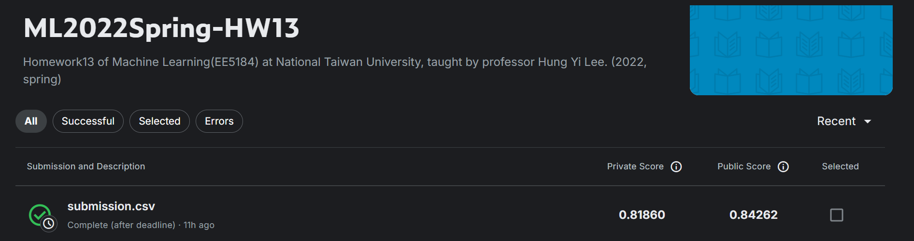

# Homework 13 - Network Compression


**kaggle url:** [ML2022Spring-hw13](https://www.kaggle.com/competitions/ml2022spring-hw13/overview)
**PDF url:** [HW13.pdf](https://speech.ee.ntu.edu.tw/~hylee/ml/ml2022-course-data/Machine%20Learning%20HW13.pdf)

### Task
Network Compression: Make your model smaller without losing the performance.
● In this task, you need to train a very small model to complete HW3 (image classification on the food-11 dataset)

### Intro
There are many different techniques in network compression. In this homework, we focus more on these three concepts.
● Knowledge distillation
● Architecture design
● Network pruning (Report Q3)

### Dataset
● The images are collected from the food-11 dataset classified into 11 classes.
● Training set: 9866 labeled images
● Validation set: 3430 labeled images
● Evaluation set: 3347 images
● DO NOT attempt to find the original labels of the testing set.
● DO NOT use any external datasets. 

### Grading -- Kaggle and Hints
```
---- simple baseline ----
Simple baseline (acc > 0.44820, <1hour):
Just run the code and submit answer.

---- medium baseline ----
Medium baseline (acc > 0.64840, <3hour):
Complete KL divergence loss function for knowledge distillation, control alpha & T and train longer.

---- strong baseline ----
Strong baseline (acc > 0.82370, 8~12hour):
○ Modify model architecture with depth-wise and point-wise convolutions.
■ You can also take great ideas from MobileNet, ShuffleNet,DenseNet, SqueezeNet, GhostNet, etc.
○ Any method and techniques you learned in HW3. For example,stronger data augmentation, hyperparameters you used in HW3. 

---- boss baseline ----
Boss baseline (acc > 0.85159, unmeasurable):
○ Implement other advanced knowledge distillation
■ For example, FitNet, Relational KD, DML
○ Make your teacher much stronger
■ If your teacher is too strong, you can consider TAKD techniques.
```

### 成绩
