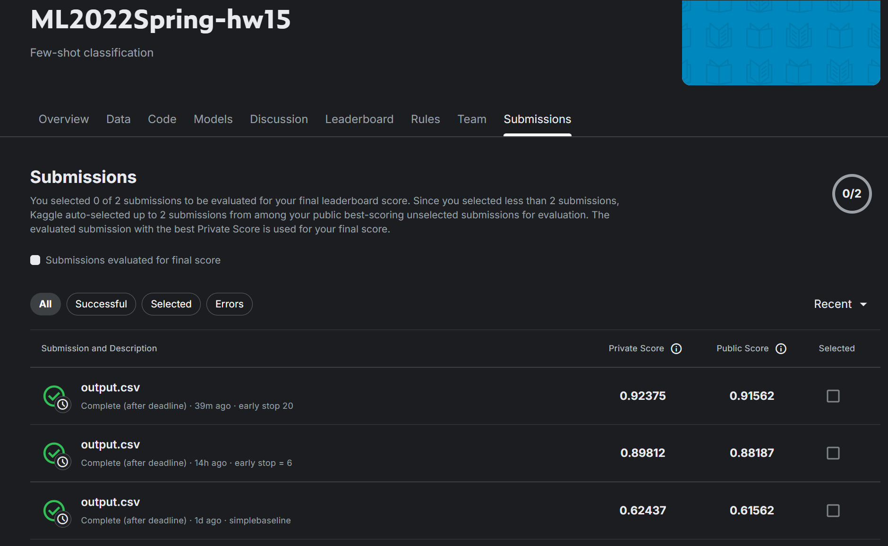

# Homework 15 - Meta Learning


**kaggle url:** [ML2022Spring-hw15](https://www.kaggle.com/competitions/ml2022spring-hw15/overvieww)
**PDF url:** [HW15.pdf](https://speech.ee.ntu.edu.tw/~hylee/ml/ml2022-course-data/ML2022%20HW15%20Meta%20Learning.pdf)

### Dataset
● Training / validation set:
30 alphabets
- multiple characters in one alphabet
- 20 images for one character

● Testing set:
640 support and query pairs
- 5 support images
- 5 query images

● Omniglot数据集是什么？
```
📚 训练集（30个字母表）：
- 中文字符：你、我、他、她、它...
- 阿拉伯文字符：ا، ب، ت، ث، ج...  
- 泰文字符：ก、ข、ค、ง、จ...
- 希伯来文字符：א، ב، ג، ד، ה...
- 日文平假名：あ、い、う、え、お...
- ...还有25个其他语言的字母表

📝 测试集（20个字母表）：
- 完全不同的语言文字（模型从没见过的）
- 比如：梵文、古埃及文、某个部落语言等
```
每个字符的数据：
每个字符有20张手写图片
就像20个不同的人写同一个字，字迹都不一样

###  什么是"5-way 1-shot分类"？
用考试来比喻：
想象你要参加一个超难的考试：
考试规则：
5-way：每道题有5个选项（A、B、C、D、E）
1-shot：每个选项你只能看到1个例子
目标：根据这1个例子，判断新的字符属于哪个选项

具体例子：
题目设置（支持集 - Support Set）：
```
选项A：给你看1张 "ㄱ" 的手写图片
选项B：给你看1张 "ㄴ" 的手写图片  
选项C：给你看1张 "ㄷ" 的手写图片
选项D：给你看1张 "ㄹ" 的手写图片
选项E：给你看1张 "ㅁ" 的手写图片
```
问题（查询集 - Query Set）：
```
现在给你5张新的手写字符图片，每张都是上面5个字符中的一个
但是字迹不同（不同人写的）
你要判断每张图片分别是A、B、C、D、E中的哪一个？
```

### Task: Few-shot Classification
● The Omniglot dataset
- background set: 30 alphabets
- evaluation set: 20 alphabets

Problem setup: 5-way 1-shot classification
● Training MAML on Omniglot classification task.

### Grading -- Kaggle and Hints
```
---- simple baseline ----
Simple baseline (acc ~ 0.6)
- Transfer learning (sample code)

---- medium baseline ----
 Medium baseline (acc ~ 0.7)
- Meta learning (FO-MAML)

---- strong baseline ----
Strong baseline (acc ~ 0.9)
- Meta learning (MAML)

---- boss baseline ----
Boss baseline (acc ~ 0.95)
- Meta learning (MAML) + task augmentation
```

### 模型优化

1. 训练参数调整
max_epoch的调整：
max_epoch = 30  ->  max_epoch = 100

2. MetaSolver函数的核心实现
```
def MetaSolver(...):
 # ... 前面代码相同 ...

    for meta_batch in x:  # 遍历meta batch中的每个任务
        # ===== 新增：数据增强部分 =====
        if torch.rand(1).item() > 0.6:  # 40%的概率进行数据增强（随机数>0.6）
            # 随机选择旋转角度：50%概率旋转90度，50%概率旋转270度
            times = 1 if torch.rand(1).item() > 0.5 else 3  # times=1表示90度，times=3表示270度
            # 对图像进行旋转，[-1, -2]表示在最后两个维度（高度和宽度）上旋转
            meta_batch = torch.rot90(meta_batch, times, [-1, -2])
        
        # 分离支持集和查询集
        support_set = meta_batch[: n_way * k_shot]    # 前n_way*k_shot个样本作为支持集（用于快速适应）
        query_set = meta_batch[n_way * k_shot :]      # 剩余样本作为查询集（用于测试适应效果）
        
        # ===== MAML算法的核心实现 =====
        # 获取模型当前的所有参数，创建一个副本用于快速适应
        fast_weights = OrderedDict(model.named_parameters())
        
        # 内循环：在支持集上进行快速适应
        for inner_step in range(inner_train_step):  # 执行inner_train_step次内循环更新
            # 为支持集创建标签 [0,1,2,3,4] 对应5-way分类
            train_label = create_label(n_way, k_shot).to(device)
            
            # 使用当前的fast_weights进行前向传播
            logits = model.functional_forward(support_set, fast_weights)
            
            # 计算支持集上的损失
            loss = criterion(logits, train_label)
            
            # ===== 关键：计算梯度并更新fast_weights =====
            # 计算损失对fast_weights中每个参数的梯度
            # create_graph=True是为了支持二阶梯度（MAML需要）
            grads = torch.autograd.grad(loss, fast_weights.values(), create_graph=True)
            
            # 使用梯度下降更新fast_weights：新参数 = 旧参数 - 学习率 × 梯度
            fast_weights = OrderedDict(
                (name, param - inner_lr * grad)  # 对每个参数进行更新
                for ((name, param), grad) in zip(fast_weights.items(), grads)  # 配对参数和对应梯度
            )
        
        # 内循环完成后，使用更新后的fast_weights在查询集上计算损失
        if not return_labels:  # 如果不是要返回标签（即正常训练/验证模式）
            # 为查询集创建标签
            val_label = create_label(n_way, q_query).to(device)
            
            # 使用适应后的参数在查询集上预测
            logits = model.functional_forward(query_set, fast_weights)
            
            # 计算查询集上的损失（这个损失用于更新原始模型参数）
            loss = criterion(logits, val_label)
            task_loss.append(loss)  # 存储这个任务的损失
            task_acc.append(calculate_accuracy(logits, val_label))  # 存储这个任务的准确率
        else:  # 如果要返回预测标签（测试模式）
            logits = model.functional_forward(query_set, fast_weights)
            labels.extend(torch.argmax(logits, -1).cpu().numpy())  # 获取预测类别
    
    # 如果是测试模式，直接返回预测标签
    if return_labels:
        return labels
    
    # ===== 外循环：Meta更新 =====
    model.train()  # 设置模型为训练模式
    optimizer.zero_grad()  # 清空之前的梯度
    
    # 计算所有任务损失的平均值（meta loss）
    meta_batch_loss = torch.stack(task_loss).mean()
    
    if train:  # 如果是训练模式
        # ===== 关键：执行meta更新 =====
        meta_batch_loss.backward()  # 反向传播计算原始模型参数的梯度
        optimizer.step()            # 使用梯度更新原始模型参数
    
    # 计算平均准确率
    task_acc = np.mean(task_acc)
    
    return meta_batch_loss, task_acc
```

3.solver类型选择
● solver = 'base'   ->  solver = 'meta'  
● BaseSolver vs MetaSolver 详细对比
| 方面 | BaseSolver | MetaSolver |
|------|--------|------|
| **训练策略** | 传统监督学习 | 元学习（学会学习） |
| **训练时行为** | 直接在支持集上训练 | 模拟测试过程进行训练 |
| **更新目标** | 学会分类当前任务  | 学会快速适应新任务 |
| **梯度类型** | 一阶梯度 | 二阶梯度 |
| **泛化能力** | 对训练过的类别效果好 | 对未见过的类别适应快 |

4.增加保存最优模型的设置

### 成绩
