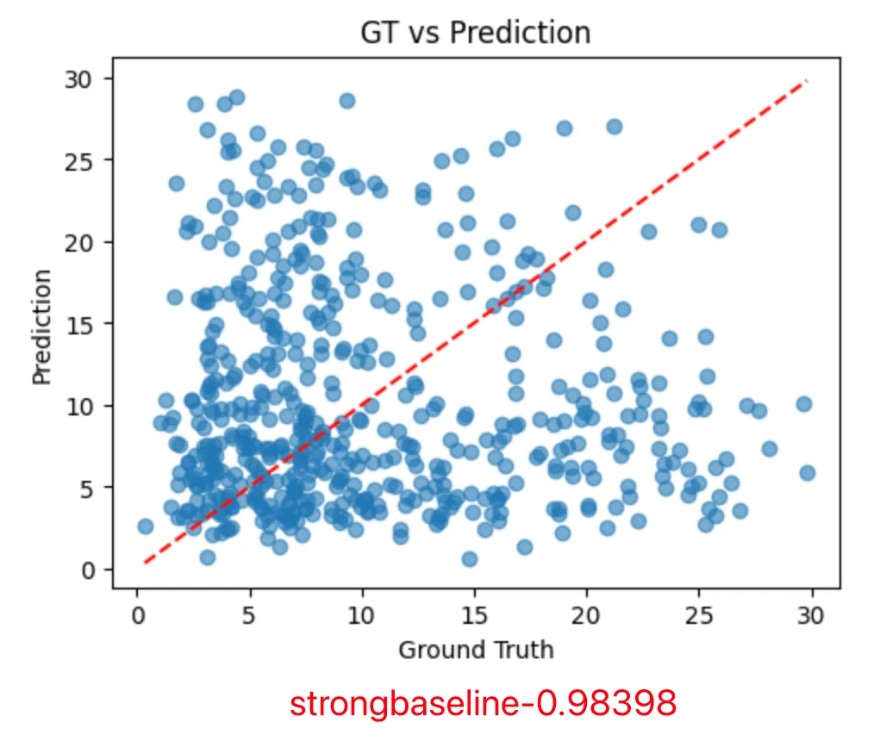

# HW 1 Regression

Homework 1: COVID-19 Cases Prediction (Regression)

**kaggle url:** [ML2022Spring-hw1](https://www.kaggle.com/competitions/ml2022spring-hw1/overview)
**PDF url:** [HW01.pdf](https://speech.ee.ntu.edu.tw/~hylee/ml/ml2022-course-data/HW01.pdf)

### Objectives
・Solve a regression problem with deep neural networks (DNN).
・Understand basic DNN training tips e.g. hyper-parameter tuning, feature selection, regularization, …
・Get familiar with PyTorch.


### Grading -- Kaggle and Hints
```
---- simple baseline ----
Score:2.28371
(original)ML2022Spring_HW1.ipynb

---- medium baseline ----
Score:1.49430
Feature selection

---- strong baseline ----
Score:1.05728
Different model architectures and optimizers

---- boss baseline ----
Score:0.86161
L2 regularization and try more parameters
```

### Analysis-特征工程
```
# 数据列解释
"""
第0列: id (样本编号)
第1-37列: AL, AK, AZ, ..., WA (37个州的one-hot编码)
第38-53列: 第1天的16个特征
第54-69列: 第2天的16个特征  
第70-85列: 第3天的16个特征
第86-101列: 第4天的16个特征
第102-117列: 第5天的16个特征
第118列: tested_positive (目标变量，第5天的阳性率)
"""

# 16个特征分别是：
features_per_day = [
    'cli',                    # COVID症状
    'ili',                    # 流感症状  
    'hh_cmnty_cli',          # 家庭社区CLI
    'nohh_cmnty_cli',        # 非家庭社区CLI
    'wearing_mask',          # 戴口罩
    'travel_outside_state',  # 州外旅行
    'work_outside_home',     # 外出工作
    'shop',                  # 购物
    'restaurant',            # 去餐厅
    'spent_time',            # 花费时间
    'large_event',           # 大型活动
    'public_transit',        # 公共交通
    'anxious',               # 焦虑
    'depressed',             # 抑郁
    'worried_finances',      # 财务担忧
    'tested_positive'        # 检测阳性(前4天的历史数据)
]
```

**step1:** 
Ground Truth vs Prediction 图: 用来直观检查模型预测质量的最重要工具之一。
在使用手动分析的特征后，选择以下特征：
```
for time_period in range(4):  # 前4天
    # 每天选择4个特征(4*4共16个特征)：
    - tested_positive  # 前几天的阳性率
    - ili             # 流感症状
    - cli             # COVID症状  
    - hh_cmnty_cli    # 家庭社区CLI
```

得到如下结果：
```
左下角（真实值0-5） ✅
・比较靠近红线，预测还算准确
右上角（真实值15+） ❌
・很分散，预测很不准确
关键问题：当真实值很高时，模型总是预测偏低！
可能原因：
・数据不平衡 - 高值样本太少，模型没学会
・模型太简单 - 3层网络可能不够
・特征不够好 - 没有能区分高值情况的特征
・数据没有归一化 - 不同特征尺度差太大
```


**step2:** 
>SelectKBest 是 scikit-learn 中的一个自动特征选择工具，它的作用就是从一大堆特征中自动挑选出"最有用"的 K 个特征。

使用SelectKBest从剩余特征中自动选12个(如图所示12个的情况下结果最好)


### 修改模型
从3个线层换到2个线性层，换成LeakyReLU，增加BatchNorm1d和Dropout的使用

什么是 LeakyReLU？ 
```python
# ReLU: 小于0的全部变成0
def relu(x):
    return max(0, x)
# 输入: [-2, -1, 0, 1, 2] 
# 输出: [0, 0, 0, 1, 2]   ← 负数信息全丢了！

# LeakyReLU: 小于0的保留一点点
def leaky_relu(x, alpha=0.01):
    return max(alpha * x, x)
# 输入: [-2, -1, 0, 1, 2]
# 输出: [-0.02, -0.01, 0, 1, 2]  ← 负数信息保留了一点点！
```

### 数据归一化
在select_feat处加上数据归一化。
>改完后发现完全没有变化

什么是数据归一化
```
# 你的原始数据可能长这样：
特征A (年龄):        [25, 30, 35, 40]     # 范围：15
特征B (收入):        [50000, 60000, 80000, 100000]  # 范围：50000 
特征C (阳性率):      [0.1, 0.2, 0.15, 0.3]  # 范围：0.2

# 归一化后变成：
特征A:              [0.0, 0.33, 0.67, 1.0]    # 范围：1
特征B:              [0.0, 0.2, 0.6, 1.0]      # 范围：1  
特征C:              [0.0, 0.5, 0.25, 1.0]     # 范围：1
```
### 优化器和学习率的修改
1.从SGD换成Adam和L2正则化
```
归一化的目标：
python# 解决"特征尺度不平衡"问题
特征A: [1, 2, 3]        → [0.0, 0.5, 1.0]
特征B: [1000, 2000, 3000] → [0.0, 0.5, 1.0]
# 让所有特征在同一起跑线
L2正则化的目标：
python# 解决"权重过大，过拟合"问题  
权重: [10.5, -8.3, 15.2] → [2.1, -1.8, 3.2]
# 让权重保持合理大小
```
2.加上学习率调度器
```
# 没有调度器 - 固定学习率
学习率 = 0.01  # 一直开60km/h

开始训练: 🚗💨💨💨 高速前进 (远离目标)
中期训练: 🚗💨💨   还是60km/h (接近目标) 
后期训练: 🚗💨💨   还是60km/h (已经很接近目标了，但步子太大，总是越过最优点!)
# 有调度器 - 动态调整学习率  
开始: 🚗💨💨💨 120km/h (快速接近)
中期: 🚗💨💨   60km/h  (稳步前进)
后期: 🚗💨     20km/h  (精细调整，准确停在最佳位置!)
```
3.同时调整配置
```
config = {
    'n_epochs': 5000,     # 3000>5000
    'learning_rate': 1e-5, #1e-3>1e-5
    'early_stop': 500,    # 400>500
}
```

### 最终成绩 strong baseline
