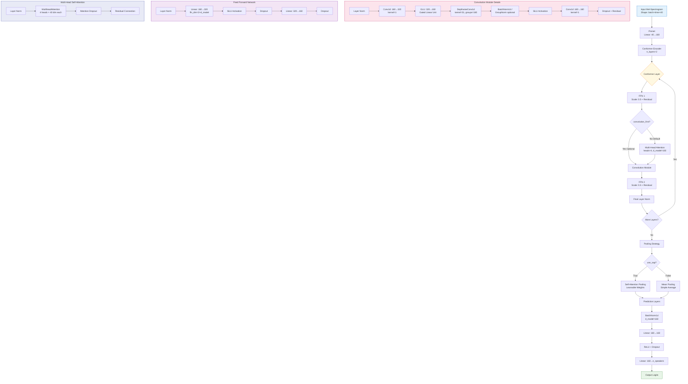

# HW 4 Self-attention

HW4 Speaker Identification (Self-attention)

**kaggle url:** [ML2022Spring-hw4](https://www.kaggle.com/competitions/ml2022spring-hw4/overview)
**PDF url:** [HW04.pdf](https://speech.ee.ntu.edu.tw/~hylee/ml/ml2022-course-data/Machine%20Learning%20HW4.pdf)

### Objectives

・Task: Multiclass Classification
・Predict speaker class from given speech
・Goal: Learn how to use Transformer.

### Grading -- Kaggle and Hints
```
---- simple baseline ----
Score: 0.60824

---- medium baseline ----
Score: 0.70375
Modify the parameters of the transformer modules in the sample code

---- strong baseline ----
Score:0.77750
Construct Conformer, which is a variety of Transformer.

---- boss baseline ----
Score:0.86500
Implement Self-Attention Pooling & Additive Margin Softmax to further
boost the performance.
```
>这里没有按照要求来做，直接用的预训练模型

### 数据结构
数据流转过程：
```python
# 1. 原始音频文件（比如 speaker_A_001.wav）
# 通过 log_melspectrogram.pt ,wav2mel.pt 和 sox_effects.pt 处理
# 收集wav音频数据
#    ↓
# 使用提供的工具处理 (log_melspectrogram.pt + wav2mel.pt + sox_effects.pt)
#    ↓
# 生成.pt特征文件和json元数据

# 2. 保存为特征文件（uttr-xxxxx.pt）
# mel频谱图通常用40个频率带来表示语音
mel_features = torch.tensor([
    [-0.065, -0.585, 2.407, ...],  # 帧1: 40维特征
    [-1.839, -1.247, 1.529, ...],  # 帧2: 40维特征
    # ... 总共N帧
])  # 形状: (N, 40)

# 3. 在metadata.json中记录
{
  "speakers": {
    "id03074": [
      {
        "feature_path": "uttr-xxxxx.pt",  # 指向上面的特征文件
        "mel_len": N                      # 帧数
      }
    ]
  }
}

# 4. 训练时，myDataset类读取数据：
def __getitem__(self, index):
    feat_path, speaker = self.data[index]  # 获取文件路径和说话人ID
    mel = torch.load(feat_path)            # 加载mel特征 (N, 40)
    
    # 随机截取128帧
    # 128帧约等于3.2秒的语音（假设每帧25ms）
    if len(mel) > 128:
        start = random.randint(0, len(mel) - 128)
        mel = mel[start:start+128]         # (128, 40)
    
    speaker_id = self.speaker2id[speaker]  # 转换为数字标签
    return mel, speaker_id

# 5. 模型处理：
# mel: (batch_size, 128, 40) → prenet → (batch_size, 128, 80)
# → transformer → (batch_size, 128, 80) → mean_pooling → (batch_size, 80)
# → pred_layer → (batch_size, n_speakers)
```

### 📁 **数据结构详解**

1. **mapping.json** - 说话人映射文件

```json
{
  "speaker2id": {
    "id00464": 0,    *// 说话人"id00464"对应数字标签0*
    "id00559": 1,    *// 说话人"id00559"对应数字标签1*
    "id00578": 2,    *// 说话人"id00578"对应数字标签2*
    ...
  }
}
```

**作用**：

- 将说话人的字符串ID转换为数字标签
- 模型训练时需要数字标签，而不是字符串
- 推理时需要反向映射（数字→姓名）

2. **metadata.json** - 训练数据元信息

```json
{
  "n_mels": 40,           *// mel频谱图的特征维度（40维）*
  "speakers": {
    "id03074": [          *// 说话人ID*
      {
        "feature_path": "uttr-18e375195dc146fd8d14b8a322c29b90.pt",  *// 特征文件路径*
        "mel_len": 435    *// 该音频的帧数长度*
      },
      {
        "feature_path": "uttr-da9917d5853049178487c065c9e8b718.pt",
        "mel_len": 490
      }
      *// ... 该说话人的其他音频文件*
    ]
  }
}
```

**作用**：

- 记录每个说话人有哪些音频文件
- 记录每个音频的长度信息
- 训练时用来构建数据集

3. **testdata.json** - 测试数据元信息

```json
{
  "n_mels": 40,
  "utterances": [
    {
      "feature_path": "uttr-b52ddeaacf1b42ff9c947eadce3e1966.pt",
      "mel_len": 813
    },
    {
      "feature_path": "uttr-fc88b32cb5c94af6817ec97e0a145d74.pt", 
      "mel_len": 738
    }
    *// ... 更多测试音频*
  ]
}
```

**作用**：

- 记录所有需要预测的音频文件
- 注意：没有说话人标签（因为这就是我们要预测的）

4. **uttr-xxxxxx.pt文件** - 实际的音频特征

```python
*# 这是一个形状为 (时间帧数, 40) 的二维张量*
tensor([
  [-6.5321e-02, -5.8502e-01, 2.4070e+00, ..., -2.5698e+00],  *# 第1帧的40维特征*
  [-1.8387e+00, -1.2468e+00, 1.5288e+00, ..., -3.0427e+00],  *# 第2帧的40维特征# ... 更多时间帧*
])
```

**详细解释**：

- **时间维度**：每一行代表一个时间帧（通常25ms）
- **特征维度**：每一列代表一个mel频率带的能量值
- **数值含义**：对数mel频谱图的能量值
    - 正值：该频率带能量较强
    - 负值：该频率带能量较弱
    - 数值范围大致在-4到+4之间


### 优化方向:


**1.数据和训练参数调整:**
```python
def __init__(self, data_dir, segment_len=192):  # 原版128 -> 192# 原因：更长序列提供更多上下文，但不会太长导致内存问题# 在 parse_args() 中
config = {
    # 学习率 = (当前步数 / warmup_steps) × 目标学习率
    "warmup_steps": 2000,    # 原版1000 -> 2000 (更平滑的学习率预热)
    "total_steps": 200000,   # 原版70000 -> 200000 (适当增加训练)
}
```
计算总 epochs 数：
```
要知道训练了多少个 epoch，需要这个公式：
总epochs = total_steps / steps_per_epoch
其中 steps_per_epoch = 训练集大小 / batch_size
由于代码中训练集是总数据的90%：
pythontrainlen = int(0.9 * len(dataset))
```

**2.模型维度升级:**
```python
class Classifier(nn.Module):
    def __init__(self, d_model=160, n_spks=600, dropout=0.1):  # 原版80 -> 200
        # 200维的优势：
        # 能学到更细致的特征
        # 比如：说话的节奏、口音细节、情感色彩等
        # 更容易区分相似的说话人
```


**3.早停机制**
```python
# 在main函数中添加
def main(..., early_stop=15):  # 这里使用15
    best_accuracy = -1.0
    best_state_dict = None
    early_stop_count = 0
    
    for step in range(total_steps):
        # 训练代码...
        
        if (step + 1) % valid_steps == 0:
            valid_accuracy = valid(valid_loader, model, criterion, device)
            
            if valid_accuracy > best_accuracy:
                best_accuracy = valid_accuracy
                best_state_dict = model.state_dict()
                early_stop_count = 0  # 重置计数
            else:
                early_stop_count += 1
                
            if early_stop_count >= early_stop:
                print(f"Early stopping at step {step+1}")
                break
```

**4.添加SpecAug到Dataset**
```python
# 在原版的 myDataset 类中添加
import random

class myDataset(Dataset):
    def __init__(self, data_dir, segment_len=192, use_spec_aug=True):  # 添加spec_aug参数
        self.data_dir = data_dir
        self.segment_len = segment_len
        self.use_spec_aug = use_spec_aug  # 新增
    
    def spec_augment(self, mel_spectrogram, 
                    time_mask_num=2, time_mask_width=10,
                    freq_mask_num=2, freq_mask_width=8):
        """新增SpecAug函数"""
        time_steps, n_mels = mel_spectrogram.shape
        augmented_mel = mel_spectrogram.clone()
        
        # Time Masking
        for _ in range(time_mask_num):
            t = random.randint(0, min(time_mask_width, time_steps))
            t0 = random.randint(0, max(1, time_steps - t))
            augmented_mel[t0:t0+t, :] = -20  # mel的padding值
        
        # Frequency Masking  
        for _ in range(freq_mask_num):
            f = random.randint(0, min(freq_mask_width, n_mels))
            f0 = random.randint(0, max(1, n_mels - f))
            augmented_mel[:, f0:f0+f] = -20
            
        return augmented_mel

    def __getitem__(self, index):
        feat_path, speaker = self.data[index]
        mel = torch.load(os.path.join(self.data_dir, feat_path))

        # 原来的分段逻辑保持不变
        if len(mel) > self.segment_len:
            start = random.randint(0, len(mel) - self.segment_len)
            mel = torch.FloatTensor(mel[start:start+self.segment_len])
        else:
            mel = torch.FloatTensor(mel)
        
        # 新增：SpecAug（只在训练时使用）
        if self.use_spec_aug and hasattr(self, 'training') and self.training:
            mel = self.spec_augment(mel)
        
        speaker = torch.FloatTensor([speaker]).long()
        return mel, speaker
```


**5.Conformer实现架构图**




### 成绩
